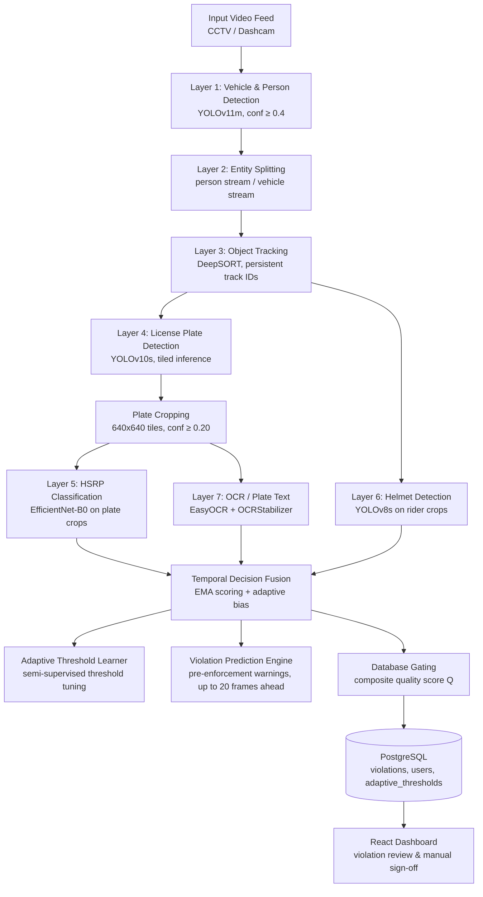
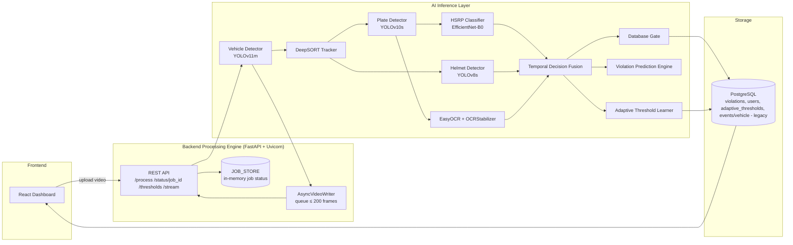

<div align="center">

# Smart-HSRP

**A temporal-fusion computer-vision system for automated HSRP, helmet, and license-plate violation detection**

[](https://www.python.org/)
[](https://fastapi.tiangolo.com/)
[](https://react.dev/)
[](https://pytorch.org/)
[](https://github.com/ultralytics/ultralytics)
[](https://opencv.org/)
[](https://www.postgresql.org/)
[](https://huggingface.co/Smolry/HSRP-classification)
[](https://huggingface.co/Smolry/Helmet-classifer)
[](#18-license)

</div>

Smart-HSRP is a computer-vision-based system that detects vehicles, tracks them over time, and classifies High Security Registration Plate (HSRP) compliance, helmet-wearing status, and license-plate text from CCTV or dashcam video, using a multi-frame **Temporal Decision Fusion** engine instead of single-frame rule triggers.

---

## Table of Contents

1. [Overview](#1-overview)
2. [How It Works](#2-how-it-works)
3. [System Architecture](#3-system-architecture)
4. [Models](#4-models)
5. [Datasets](#5-datasets)
6. [Results](#6-results)
7. [Demo](#7-demo)
8. [Repository Structure](#8-repository-structure)
9. [Configuration & Environment Variables](#9-configuration--environment-variables)
10. [Installation / Running](#10-installation--running)
11. [Testing](#11-testing)
12. [Models & Datasets — Direct Links](#12-models--datasets--direct-links)
13. [Attribution & Citations](#13-attribution--citations)
14. [Ownership / Contribution Statement](#14-ownership--contribution-statement)
15. [Limitations](#15-limitations)
16. [Future Improvements](#16-future-improvements)
17. [License](#17-license)

---

## 1. Overview

Most automated traffic-enforcement systems in India (e.g., ANPR platforms from vendors like EFKON and AIRPIX, and academic systems such as UrbanEye and UrbanFlow) make a violation decision from a **single video frame**. This produces high false-positive rates and still requires a human operator to confirm every flagged event before it can be used for enforcement.

**Smart-HSRP** instead evaluates each tracked vehicle **across many frames over time** before confirming a violation.

- **Input:** an uploaded video feed (CCTV / dashcam) submitted to a REST API.
- **Processing:** a 7-layer pipeline detects vehicles and people, tracks them across frames, detects and crops license plates, classifies HSRP compliance, detects helmet status, reads plate text via OCR, and fuses all of this evidence over time.
- **Detection vs. classification:** vehicles, people, and license plates are *detected* (localized) by YOLO-family models; HSRP compliance and helmet status are *classified* on the cropped regions produced by those detectors.
- **A violation is confirmed** only when a tracked object's fused evidence — a smoothed confidence score, a stability score, and a minimum number of frames — simultaneously clears type-specific thresholds (see [How It Works](#2-how-it-works)).
- **Output:** a stored violation record (with confidence, stability, and quality scores, and a manual-review flag where appropriate), a live annotated video stream, and a React dashboard for review.

This README describes the end-to-end system, its components, and its measured results. Detailed model architecture, training procedure, hyperparameters, and per-class evaluation for the individually trained models live in their respective Hugging Face model cards (linked in [§12](#12-models--datasets--direct-links)) — they are intentionally not reproduced here.

---

## 2. How It Works



**Pipeline summary.** Each incoming frame passes through vehicle/person detection, is split into entity streams, and is tracked with persistent IDs so evidence about the same physical object can be accumulated across frames. License plates are detected on tracked vehicles and cropped; those crops are the sole input to the HSRP classifier. In parallel, rider crops are passed to the helmet detector, and plate crops are passed to OCR. All three per-frame signals (HSRP, helmet, OCR) feed into the Temporal Decision Fusion (TDF) engine, which is the component that actually decides whether a violation is confirmed, predicted, or rejected.

**License-plate cropping pipeline (documented preprocessing).**
- Source frames are divided into non-overlapping **640×640 tiles** (stride = 640).
- Tiles smaller than **200 px** in either dimension are skipped.
- The plate detector (YOLOv10s) runs per tile with a confidence threshold of **0.20**.
- Detected plate coordinates are mapped back to the original full-resolution image.
- The corresponding plate region is cropped from the original image and saved as a **JPEG**.
- These crops are the exclusive input to the HSRP classification stage — no additional preprocessing beyond this is documented.

**Temporal Decision Fusion, in brief.** Rather than acting on a single frame's raw score, TDF maintains a per-track, per-decision-type (`HSRP` / `HELMET` / `OCR`) state: an exponential moving average of recent scores, an adaptively corrected decision threshold, and a stability metric over the last 5 observations. A violation is only confirmed once a track has accumulated enough frames, a high enough averaged confidence, and enough stability — simultaneously. Full formulas are in the accompanying paper (`docs/` — see [§8](#8-repository-structure)) and are intentionally summarized rather than reproduced in full here.

---

## 3. System Architecture



The backend exposes endpoints to upload video, poll job status, retrieve/process violations, inspect adaptive thresholds, and stream live annotated video. Job state lives in an in-memory `JOB_STORE` keyed by UUID. Processed frames are written asynchronously via a bounded queue so that disk I/O never blocks inference indefinitely (see [Limitations](#15-limitations) and the memory-management notes in `docs/`).

---

## 4. Models

| Component | Purpose | Model | Source | Ownership |
|---|---|---|---|---|
| Vehicle / person detector | Detects people, vehicles, cars, and bikes as the first pipeline stage | YOLO11 (Ultralytics) | [Ultralytics YOLO](https://github.com/ultralytics/ultralytics) | **Third-party pretrained model** — used as-is, no fine-tuning performed by this project |
| Object tracker | Assigns persistent track IDs across frames | DeepSORT | [deep-sort-realtime](https://github.com/levan92/deep_sort_realtime) | **Third-party** |
| License plate detector | Detects license plates on tracked vehicles (mAP50 = 0.979) | YOLOv10s | [Guardian-22/License_Plate_Detection_Yolov10s](https://github.com/Guardian-22/License_Plate_Detection_Yolov10s) | **Fine-tuned / developed for this project** |
| HSRP classifier | Classifies cropped plates as `HSRP` / `NON_HSRP` | EfficientNet-B0 (fine-tuned) | [🤗 Smolry/HSRP-classification](https://huggingface.co/Smolry/HSRP-classification) | **Fine-tuned / developed for this project** |
| Helmet detector / classifier | Classifies rider helmet status (`rider`, `face_no_helmet`, `face_helmet_good`, `face_helmet_bad`) | YOLOv8s (fine-tuned) | [🤗 Smolry/Helmet-classifer](https://huggingface.co/Smolry/Helmet-classifer) | **Fine-tuned / developed for this project** |
| OCR engine | Reads license-plate text from crops | EasyOCR (ResNet + BiLSTM + CTC) | [EasyOCR](https://github.com/JaidedAI/EasyOCR) | **Third-party** |

> Third-party pretrained/fine-tuned-elsewhere models are used strictly as inference components in this pipeline. No ownership of the original vehicle detector, tracker, plate-detector repository, or OCR engine is claimed by this project. For architecture, training procedure, hyperparameters, and full evaluation of the models developed for this project (HSRP classifier, helmet classifier), see their Hugging Face model cards linked above and in [§12](#12-models--datasets--direct-links).

---

## 5. Datasets

| Dataset | Purpose | Source | Relationship |
|---|---|---|---|
| HSRP classification dataset | Trains/evaluates the HSRP vs. NON_HSRP classifier | [🤗 Smolry/HSRP-classification_data](https://huggingface.co/Smolry/HSRP-classification_data) *(model card; see card for dataset details)* | **Prepared for Smart-HSRP** |
| Helmet classification dataset | Trains/evaluates the helmet-status classifier (4 classes: `rider`, `face_no_helmet`, `face_helmet_good`, `face_helmet_bad`) | [Smolry/Helmet-classifer](https://app.roboflow.com/smolry/helmet-detection_yolov8-8jenr/1/images) *(model card; see card for dataset details)* | **Prepared for Smart-HSRP** |
| License plate detection dataset | Trains YOLOv10s plate detector | [smarthsrp/license-plate-recognition-rxg4e-xyod6/2](https://app.roboflow.com/smarthsrp/license-plate-recognition-rxg4e-xyod6/2) | **Third-party dataset used by a third-party pretrained/derived model** |
| Vehicle/person detection classes | Used by the pretrained vehicle detector | Standard YOLO11 pretrained classes | **Third-party** — no project-specific dataset used (no fine-tuning) |

Dataset licenses are documented in each linked Hugging Face dataset/model card; consult those cards for full documentation rather than this README.

---

## 6. Results

All figures below are reproduced from the project's evaluation as documented in the accompanying technical paper (`docs/`). They are **model-level and pipeline-level evaluation results**, not a claim of real-world deployment accuracy at scale.

### Model-level evaluation

| Model | Precision | Recall | F1-Score | mAP50 |
|---|---|---|---|---|
| HSRP Classifier (EfficientNet-B0) | 0.88 | 0.88 (HSRP) / 0.86 (NON_HSRP) | 0.87 / 0.87 | N/A |
| Plate Detector (YOLOv10s) | 0.981 | 0.949 | N/A | 0.979 |
| Helmet Detector (YOLOv8s) | 0.78 | 0.888 | N/A | 0.896 |
| Vehicle Detector (YOLOv11m, pretrained) | 0.91 | 0.87 | N/A | 0.94 |

- The **HSRP classifier** reaches **87.5% test accuracy** on the binary HSRP / NON_HSRP task, with balanced precision/recall across both classes.
- The **helmet detector** performs well on `rider` and `face_no_helmet` (mAP50 > 0.739) but is notably weaker on `face_helmet_bad` (precision 0.373, recall 0.283), attributed to limited training examples of incorrectly worn helmets.

### End-to-end / system-level results (Temporal Decision Fusion vs. single-frame baseline)

Measured on a separate ~90-minute batch of dashcam footage, comparing single-frame thresholding (TDF disabled) against the full TDF pipeline:

- **False positives reduced by 63.4%** with TDF enabled.
- **True-positive recall dropped by only 4.8%** relative to the single-frame baseline (overall system recall reported at **95.2%**).
- **Precision improved from 0.61 → 0.91** at matched settings.
- The adaptive quality gate (`Q ≥ 0.55`) filtered out a further **8.2%** of TDF-confirmed events, mostly cases with unstable tracking due to occlusion.
- The Violation Prediction Engine issued early warnings for **81.4%** of confirmed HSRP violations (~7 frames ahead on average) and **74.2%** of confirmed helmet violations.
- Throughput: **18.3 fps** at `frame_skip=1` (1080p, RTX 3060), or **31.4 fps** (real-time) at `frame_skip=2`, with an average end-to-end annotation latency of **54.7 ms**.

> The 87.5% HSRP-classifier accuracy is a **model-level** metric on plate crops, not the same as the system's end-to-end violation-confirmation accuracy — the two should not be conflated. Do not describe the system as "state-of-the-art" or "production-ready" beyond what is stated above.

---

## 7. Demo

[Add demo image/GIF/video here — e.g., input frame → vehicle/plate detection → plate crop → HSRP classification → confirmed violation]


---

## 8. Repository Structure

```
Smart-HSRP-detection/
                    
├── backend/               # 7-layer frame processing pipeline
│   ├── tests/               # Unit / integration tests
│   ├── db/                  # SQLAlchemy models, PostgreSQL schema/migrations
│   ├── models/              # Vehicle, plate, helmet detection wrappers
│   ├── api/
│   │   └──routes.py                 # FastAPI application (endpoints, job orchestration)
│   ├── services/
│   │   ├──cropper.py
│   │   ├──decision_managers.py    # database gating decision manager
│   │   ├──ocr_stabilizer.py       # EasyOCR + OCRStabilizer
│   │   ├──storage.py
│   │   ├──vehicle_tracker.py        # DeepSORT integration
│   │   └──video_reader.py
│   ├── utils/           # contains computational helper functions
│   ├── core/
│   │   ├──adaptive_threshold.py        # Adaptive Threshold Learner (ATL)
│   │   ├──db_gate.py                   # Database Gate (DBG)
│   │   ├──frame_pipeline.py
│   │   ├──model_registry.py
│   │   ├──rules.py                      # Final decision manager rules
│   │   ├──temporal_fusion.py            # Temporal Decision Fusion (TDF)
│   │   ├──video_annotator.py
│   │   ├──video_pipeline.py
│   │   └──violation_predictor.py         # Violation Prediction Engine (VPE)                         
├── config/                   # HSRP-classification specific utilities / inference wrappers
├── frontend/              # React frontend
├── state/                  # thresholds.json persistence (adaptive threshold state)
├── main.py                 # Backends entry point
├── docs/                   # Technical documentation (incl. this project's paper)
├── .env.example            # Example environment configuration (no secrets)
└── README.md
```

---

## 9. Configuration & Environment Variables

Runtime configuration is provided via a `.env` file containing model paths, confidence thresholds, the database URL, the JWT secret, and `frame_skip` (default `1`, i.e., every frame is processed).

- `.env` contains deployment-specific values and **secrets** — it must **never** be committed.
- `.env.example` (with placeholder values only) **should** be committed.
- Non-sensitive configuration (model paths, confidence thresholds, `frame_skip`) should preferably live in version-controlled config files where the project supports it.
- Database credentials, JWT secrets, and API keys must always stay out of Git.

```dotenv
# .env.example — placeholders only, do not put real secrets here
DATABASE_URL=postgresql+asyncpg://[USER]:[PASSWORD]@[HOST]:5432/[DB_NAME]
JWT_SECRET=[ADD_VALUE]
VEHICLE_MODEL_PATH=[ADD_PATH_TO_YOLO11_WEIGHTS]
PLATE_MODEL_PATH=[ADD_PATH_TO_YOLOV10S_WEIGHTS]
HSRP_MODEL_PATH=[ADD_PATH_TO_EFFICIENTNET_B0_WEIGHTS]
HELMET_MODEL_PATH=[ADD_PATH_TO_YOLOV8S_WEIGHTS]
FRAME_SKIP=1
```

---

## 10. Installation / Running

> Replace placeholder commands with the exact commands used in the repository if they differ.

```bash
# 1. Clone the repository
git clone https://github.com/Smolry/Smart-HSRP-detection.git
cd Smart-HSRP-detection
git checkout gpu-version

# 2. Install dependencies
pip install -r requirements.txt

# 3. Configure environment
cp .env.example .env
# edit .env with real database URL, JWT secret, and model paths

# 4. Obtain model artifacts
# - HSRP classifier: https://huggingface.co/Smolry/HSRP-classification
# - Helmet classifier: https://huggingface.co/Smolry/Helmet-classifer
# - Plate detector (YOLOv10s): https://github.com/Guardian-22/License_Plate_Detection_Yolov10s
# - Vehicle detector: pretrained YOLO11 weights (Ultralytics)

# 5. Start backend (FastAPI + Uvicorn)
uvicorn app.main:app --host 0.0.0.0 --port 8000

# 6. Start frontend dashboard (React)
React run dashboard/app.py

# 7. Run tests
pytest tests/
```


---

## 11. Testing

```bash
pytest tests/
```

[TODO: distinguish unit vs. integration test commands/paths if the repository separates them, e.g. `pytest tests/unit` / `pytest tests/integration`]

Test coverage percentages are not reported here unless actually measured by the project's CI. [TODO: add coverage badge/command if coverage is measured]

---

## 12. Models & Datasets — Direct Links

| Artifact | Type | Link | Nature |
|---|---|---|---|
| HSRP Classifier | Model | [huggingface.co/Smolry/HSRP-classification](https://huggingface.co/Smolry/HSRP-classification) | **My own artifact** |
| Helmet Classifier | Model | [huggingface.co/Smolry/Helmet-classifer](https://huggingface.co/Smolry/Helmet-classifer) | **My own artifact** |
| Main application repository | Code | [github.com/Smolry/Smart-HSRP-detection (gpu-version)](https://github.com/Smolry/Smart-HSRP-detection/tree/gpu-version) | **My own repository** |
| License Plate Detector (YOLOv10s) | Model/code | [github.com/Guardian-22/License_Plate_Detection_Yolov10s](https://github.com/Guardian-22/License_Plate_Detection_Yolov10s) | **Original third-party source** |
| Vehicle/person detector (YOLO11) | Model | [github.com/ultralytics/ultralytics](https://github.com/ultralytics/ultralytics) | **Original third-party source** (used pretrained, unmodified) |
| OCR engine | Library | [github.com/JaidedAI/EasyOCR](https://github.com/JaidedAI/EasyOCR) | **Original third-party source** |
| Object tracker | Library | [github.com/levan92/deep_sort_realtime](https://github.com/levan92/deep_sort_realtime) | **Original third-party source** |

The original repositories/pages above remain the authoritative source for third-party components; this project's Hugging Face links are archival/derived artifacts for the components it developed itself (HSRP classifier, helmet classifier) only.

---

## 13. Attribution & Citations

| Component | Original Source | License | Usage in Smart-HSRP |
|---|---|---|---|
| YOLO (v8 / v10 / v11 family) | [Ultralytics YOLO](https://github.com/ultralytics/ultralytics) | AGPL-3.0 / Enterprise License | Vehicle/person detection (YOLOv11m, pretrained, unmodified); base architecture for fine-tuned helmet detector (YOLOv8s) |
| License plate detector (YOLOv10s) | [Guardian-22/License_Plate_Detection_Yolov10s](https://github.com/Guardian-22/License_Plate_Detection_Yolov10s) | MIT License (repository); underlying Roboflow dataset is CC BY 4.0 | Plate detection stage of the pipeline |
| EfficientNet-B0 | M. Tan and Q. V. Le, ["EfficientNet: Rethinking Model Scaling for Convolutional Neural Networks"](https://arxiv.org/abs/1905.11946), ICML 2019; implementation via [TorchVision](https://github.com/pytorch/vision) | BSD-3-Clause (TorchVision implementation) | Backbone architecture used for the HSRP classifier; initialized with ImageNet weights and fine-tuned |
| DeepSORT | N. Wojke, A. Bewley, D. Paulus, ["Simple Online and Realtime Tracking with a Deep Association Metric"](https://arxiv.org/abs/1703.07402), ICIP 2017; [deep-sort-realtime](https://github.com/levan92/deep_sort_realtime) | MIT License | Multi-object tracking across frames |
| EasyOCR | [JaidedAI/EasyOCR](https://github.com/JaidedAI/EasyOCR) | Apache-2.0 | License-plate text recognition |
All components listed above are **third-party** and are credited to their original authors/organizations; no ownership of these components is claimed by this project.

**Academic references used in the design of this system:**

- S. Gowroju, S. Choudhary, N. Sathwik, A. Banu, E. V. Kumar, N. Ashritha, "UrbanEye: Deep Learning Enhanced Two-Wheeler Traffic Rule Violation Detection using YOLO and OCR," *ISAC3 2025*, doi: 10.1109/ISAC364032.2025.11156855.
- S. Patil, O. Baji, M. Bagul, S. Bhangare, K. Bhutada, "Urban Flow – An Integrated Smart Traffic Management System," *ASIANCON 2025*, doi: 10.1109/ASIANCON66527.2025.11281127.
- Y. Fang, R. Zhang, Q. F. Wang, K. Huang, "Action Recognition in Videos with Temporal Segments Fusions," *BICS 2019*, LNCS vol. 11691, Springer, doi: 10.1007/978-3-030-39431-8_23.
- G. Jocher et al., "Ultralytics YOLO," Version 8.0.0, 2023. https://github.com/ultralytics/ultralytics
- M. Tan, Q. V. Le, "EfficientNet: Rethinking Model Scaling for Convolutional Neural Networks," *ICML 2019*, PMLR vol. 97, pp. 6105–6114.
- N. Wojke, A. Bewley, D. Paulus, "Simple Online and Realtime Tracking with a Deep Association Metric," *IEEE ICIP*.

If this project is cited academically, cite the accompanying paper directly rather than this repository. [TODO: add full BibTeX once the paper is formally published/indexed]

---

## 14. Ownership / Contribution Statement

Smart-HSRP integrates both project-developed components and third-party pretrained models.

- The **Smart-HSRP application/pipeline** (7-layer processing pipeline, Temporal Decision Fusion, Adaptive Threshold Learner, Database Gate, Violation Prediction Engine, backend, and dashboard) and the **project-specific HSRP and helmet classification work** are contributions of this project.
- The **vehicle/person detector (YOLO11)**, **object tracker (DeepSORT)**, **license-plate detector (YOLOv10s)**, and **OCR engine (EasyOCR)** are third-party pretrained models/libraries, used as pipeline components. Their original authors are credited in [§13](#13-attribution--citations).
- Archival copies of project-developed models hosted on Hugging Face do **not** imply ownership of any third-party model or dataset referenced above.
- ## Collaborators
    | <a href="https://github.com/Guardian-22"></a> | <a href="https://github.com/Smolry"></a> | <a href="https://github.com/ketanb27"></a> | <a href="https://github.com/Parth-54"></a> |
    |---|---|---|---|
    | **@Guardian-22** | **@Smolry** | **@ketanb27** | **@Parth-54** |

---

## 15. Limitations

- The helmet detector's `face_helmet_bad` class has low precision/recall (0.373 / 0.283) due to limited training examples of incorrectly worn helmets.
- Errors in license-plate detection or tracking propagate downstream and can degrade HSRP classification and OCR quality.
- Reported model metrics (e.g., 87.5% HSRP classifier accuracy) are **model-level** evaluation results on held-out test data, not guarantees of real-world deployment accuracy under all lighting, camera-angle, and occlusion conditions.
- Domain shift (camera placement, lighting, plate wear/damage) relative to the training distribution can reduce real-world performance.
- Detection and classification depend on configured confidence thresholds; the Adaptive Threshold Learner adjusts these online but assumes reasonably reliable pseudo-labels (confidence ≥ 0.75).
- Throughput is hardware-dependent; real-time operation at `frame_skip=1` is not guaranteed on all GPUs.

---

## 16. Future Improvements

- Edge deployment via model quantization (INT8) and TensorRT serialization for real-time inference on devices such as NVIDIA Jetson.
- Extending detection to additional violation types (e.g., triple riding, seatbelt, wrong-side driving), requiring multi-person tracking logic and additional training data.
- Federated learning so individual cameras can update adaptive thresholds locally without transmitting raw video to a central server.

---

## 17. License

[Apache-2.0]

This license applies to the **Smart-HSRP application code** developed for this project. It does **not** override or replace the licenses of third-party components (YOLO/Ultralytics, EasyOCR, DeepSORT, the third-party plate-detector repository, etc.), each of which remains governed by its own original license — see [§13](#13-attribution--citations). Consult each component's original source for its applicable license terms before redistribution or commercial use.
